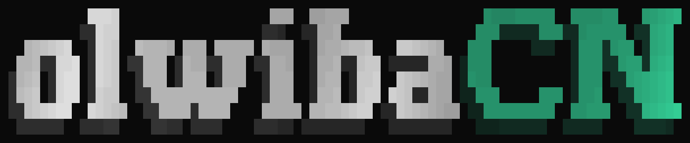

<p align="center">
  <picture>
    <source media="(prefers-color-scheme: light)" srcset="./public/olwibaCN--light.gif" />
    <source media="(prefers-color-scheme: dark)" srcset="./public/olwibaCN.gif" />
    
  </picture>
</p>

<p align="center">
  <strong>Olwiba's take on shadcn primitives.</strong>
</p>

<p align="center">
  <a href="https://cn.olwiba.com">Documentation</a>
</p>

<p align="center">
  <a href="https://github.com/Olwiba/olwibaCN/issues/new?template=bug_report.md">🪲 Report a bug</a> ·
  <a href="https://github.com/Olwiba/olwibaCN/issues/new?template=feature_request.md">✨ Feature request</a>
</p>

<p align="center">
  <a href="https://github.com/sponsors/Olwiba"></a>
  <a href="LICENSE"></a>
  <a href="https://github.com/Olwiba/olwibaCN/issues"></a>
</p>

## What This Is

`@olwiba/cn` is a custom shadcn component registry. It contains beautifully designed, copy-paste ready primitive components built on React 19 and Tailwind CSS v4.

Primitives are the individual lego pieces for building on the web.

If you're interested in composite components, these are prebuilt, opinionated combinations of primitives that solve specific UI problems. They're coming soon in `@olwiba/ui`.

The project introduces the idea of a `mode` prop, this lets you dial in the visual personality without touching variants or structure. Pair that with seven built-in color themes and you get a design system that can conform to your project.

It ships two ways — as an installable package or as a shadcn registry you can copy directly into your project.

## Installation

```bash
bun add @olwiba/cn
```

Peer dependencies: `react`, `react-dom`, `tailwindcss`, `lucide-react`

```tsx
import "@olwiba/cn/styles";
import { Button, Card, UIVariantProvider } from "@olwiba/cn";

export function Example() {
  return (
    <UIVariantProvider mode="smooth">
      <Card className="p-6">
        <Button>Continue</Button>
      </Card>
    </UIVariantProvider>
  );
}
```

Available CSS entrypoints: `@olwiba/cn/styles`, `@olwiba/cn/theme`, `@olwiba/cn/preset`

## Registry

Prefer owning the source? Add the registry to your `components.json` and copy components directly into your project.

```json
{
  "registries": {
    "@olwibacn": "https://cn.olwiba.com/r/{name}.json"
  }
}
```

```bash
shadcn add @olwibacn/button
```

## What's Included

**Themes** Choose your brand color
**Modes** Default (blocky/sharp), Smooth, Playful
**Icons** Bring your own icon library!
**Components** The things you can see and interact with
**Mechanics** The behaviours that bring your project to life

## Tech Stack

- [React](https://react.dev) 19
- [TypeScript](https://www.typescriptlang.org)
- [Tailwind CSS](https://tailwindcss.com) v4
- [Radix UI](https://www.radix-ui.com)
- [shadcn/ui](https://ui.shadcn.com)
- [Lucide React](https://lucide.dev)
- [CVA](https://cva.style)

## Ecosystem

- _Coming soon!_

## Contributing

Bug reports, pull requests & feature requests are welcome.
Open an issue first for anything beyond a small fix.

<br/>
<br/>

<p align="center">
  Built with 💖 by <a href="https://github.com/Olwiba">Olwiba</a>
</p>

<p align="center">
  <a href="https://buymeacoffee.com/olwiba"></a>
</p>